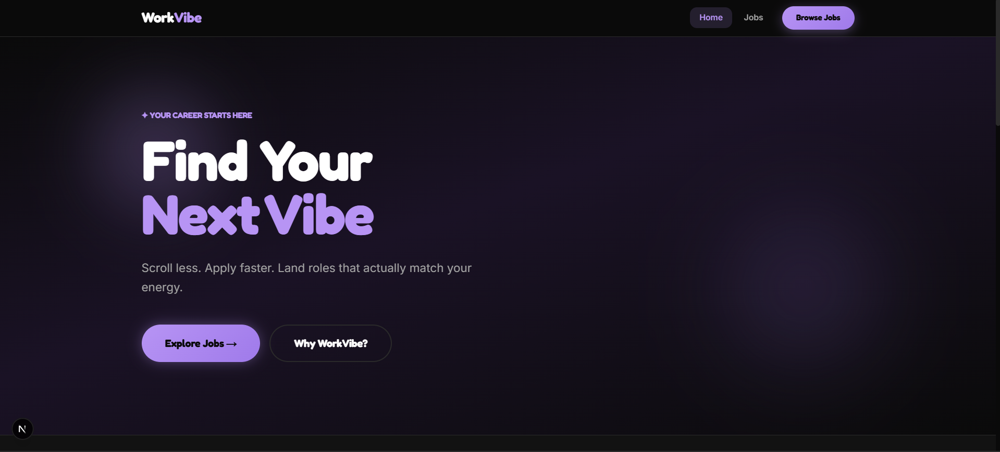
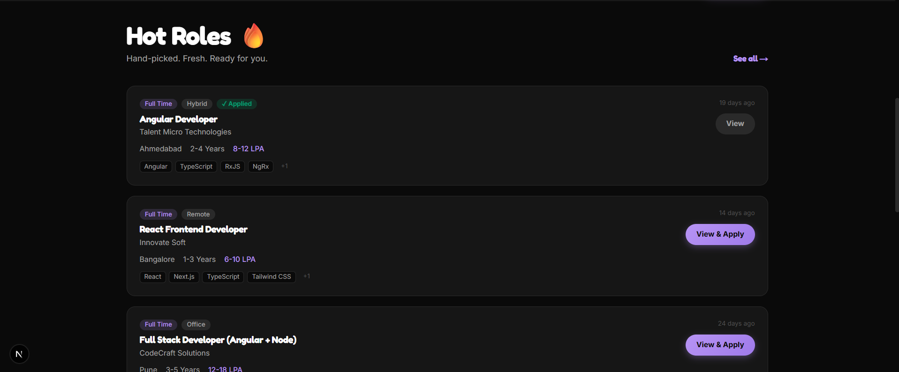
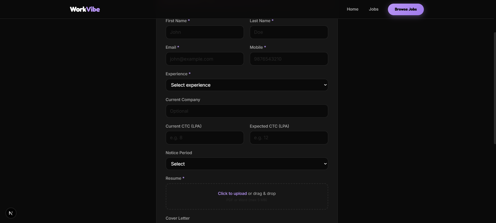
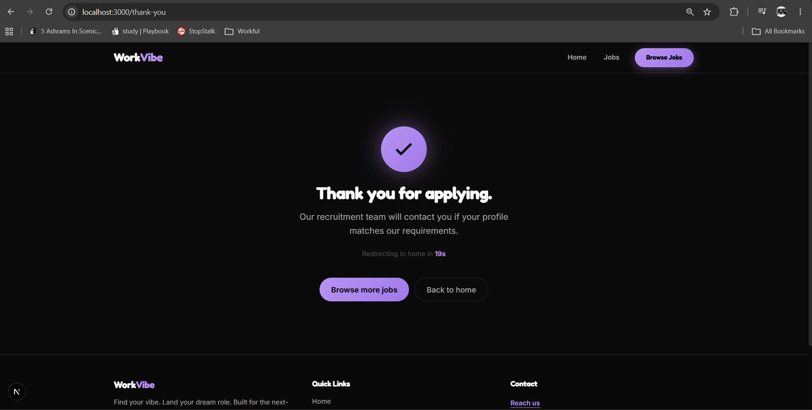

# WorkVibe — Career Portal

Frontend Developer Assignment — Career Portal for candidates to browse jobs and apply online.

**Live demo:** Run locally with `npm run dev` → http://localhost:3000

---

## Screenshots

### Home Page


### Job Listings / Hot Roles


### Apply Form


### Thank You Page


---

## Tech Stack

| Technology | Usage |
|------------|--------|
| **Next.js** (App Router) | Routing, SSR/SSG, project structure |
| **React 19** | UI components |
| **TypeScript** | Type safety |
| **Tailwind CSS** | Styling & responsive design |
| **Static mock data** | No backend required (local JSON in `src/data/jobs.ts`) |

> Angular was preferred in the brief; this submission uses **Next.js / React**, which is listed under *Other Accepted Frameworks*.

---

## Setup Instructions

```bash
# 1. Install dependencies
npm install

# 2. Start development server
npm run dev

# 3. Open in browser
http://localhost:3000
```

### Production build

```bash
npm run build
npm start
```

---

## Features Implemented

### Functional requirements
- **Home page** — Hero, intro, featured jobs, why join us, footer  
- **Job listing** — All jobs with cards (title, company, experience, location, type, salary, posted date, apply)  
- **Search** — By title, company, skills, keywords  
- **Filters** — Location, experience, job type, remote/hybrid/office  
- **Sorting** — Latest, oldest, salary, experience  
- **Pagination**  
- **Job details** — Description, responsibilities, skills, benefits, company info, apply CTA  
- **Apply form** — All required fields + validations  
- **Thank you page** — Confirmation after successful application  
- **Loading / empty / 404 states**  
- **Responsive** — Mobile, tablet, desktop  

### Form validation
- Required fields  
- Valid email format  
- Mobile number validation (10-digit)  
- Resume file type (PDF / Word)  
- Max file size (5 MB)  

### Bonus / extra credit
- Reusable UI components (`Header`, `Footer`, `JobCard`, `ApplyButton`)  
- Advanced filtering + **URL-based filter persistence**  
- File upload preview  
- Form auto-save to localStorage  
- Applied-job tracking  
- Accessibility (labels, semantic HTML, ARIA)  
- Excellent responsive design  

---

## Thank You Message

```
Thank you for applying.
Our recruitment team will contact you if your profile matches our requirements.
```

---

## Project Structure

```
src/
 ├── app/
 │    ├── page.tsx              # Home
 │    ├── layout.tsx
 │    ├── not-found.tsx
 │    ├── jobs/
 │    │    ├── page.tsx         # Listing
 │    │    └── [id]/page.tsx   # Details
 │    ├── apply/[id]/page.tsx  # Application form
 │    └── thank-you/page.tsx
 ├── components/
 ├── data/jobs.ts
 ├── lib/applied.ts
 └── types/job.ts
docs/
 └── screenshots/               # README images
```

---

## Assumptions

- No real backend — jobs from static mock data  
- Resume validated client-side only  
- Applied status & form drafts in `localStorage`  
- **Reach us** → mailto:iaamharshsinghrajput@gmail.com  

---

## Known Limitations

- No authentication  
- No real file upload API  
- Salary sort uses simple number parsing  

---

## Future Improvements

- Real API integration  
- Unit tests  
- Skeleton loaders  
- PWA support  

---

## Contact

**Reach us:** [iaamharshsinghrajput@gmail.com](mailto:iaamharshsinghrajput@gmail.com)
